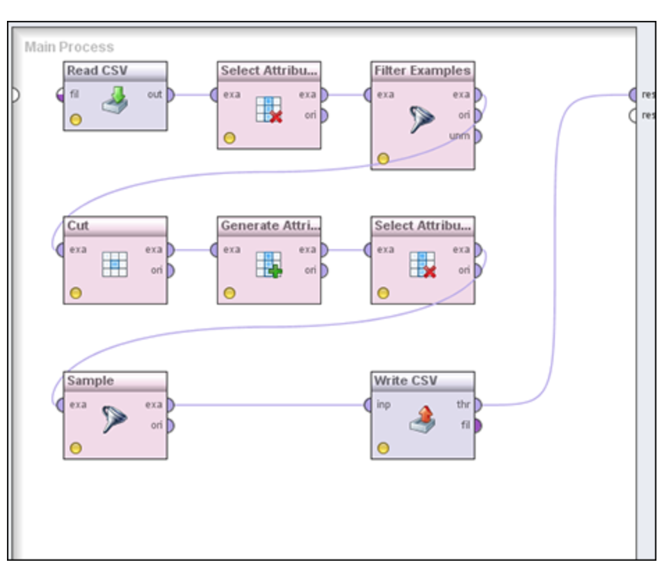

# Part 1: Getting Started with Data Mining
### What to learn:
  - Understanding how data miners work
  - Looking over a data miners shoulder
  - Working constructively with your counterparts on complementary professions
  - Keeping it legal with good data privacy protection
  - Communicating with executives

## Chapter 2: A Day in Your Life as a Data Miner

### In this chapter:
  - Participating in a data-mining team
  - Focusing on a business goal
  - Framing your work with an industry-standard process
  - Comparing data with expectations

### Starting Your Day Off Right
  - Teamwork is important
  - Data mining isn’t magical, and its purpose is to eliminate mystery, a little bit at a time, from your business.
  - Exploring with aim  
  - Your first priority must always be to address the business goals established at the start of the project.

### Structuring time with the right process

### 1. Understanding Your Business Goals
  - By asking probing questions in the business-understanding phase, you help everyone to clarify thinking, define reasonable goals, and set realistic expectations.
  - Demonstrate the feasibility of modeling
  - Discuss with the client

### 2. Understanding Your Data
  - Gather and broadly describe your data
  - Then you’ll examine the data in a little more depth, exploring the data one variable (field) at a time, checking for consistency with expectations and any obvious signs of data quality problems.

    #### 2.1 Describing data
    - Note the name and size of each file
    - Identify the variables in each file and confirm that you have adequate documentation for each of them
    - You review each variable in the data, comparing the variable names to the information in the documentation.
    - Compare fields in the data and the one in the documentation

    #### 2.2 Exploring data
    - You must check basics, such as whether the data is string or numeric, that the range of values is appropriate, and that the distribution of values looks reasonable
    - Explore: missing cases, and the range of values (low and high),  distribution graph, the average (mean), and most frequently occurring (mode) value of the variable
    - Using software that produces a basic report for each variable in the data, including information such as the range of values, the average for continuous variables, the most common value for categorical variables, and so on
    #### 2.3 Cleaning data

### 3. Preparing Your Data
  - Transform
  - Joining datasets
  - Sampling the data
  - Splitting datasets (build and test)
  - Role Management
  

### 4. Modeling Your Data
  - Build predictive models

### 5. Ecaluating Your Results
  - Using a diagnostic chart

### 6. Putting Your Results into Action
