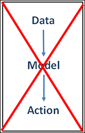
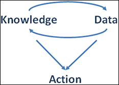

# Part 2: Exploring Data-Mining Mantras and Methods

### In this part
    - Unveiling the principles of data-mining practice
    - Exploring the data-mining process
    - Establishing a case for data mining
    - Revealing your secret plan for preventing data-mining failure
    - Acquiring the tools of the trade

## Chapter 4: Learning the Laws of Data Mining

### In this chapter
    - Getting a grip on the principles of data mining
    - Making data your informant
    - Coming to terms with imperfection

### 1st Law: Business Goals
    -  Business objectives are the origin of every data-mining solution

### 2nd Law: Business Knowledge
    - Business knowledge is central to every step of the data-mining process.
    - Your own business knowledge has more value than any data-mining tool
### 3rd Law: Data Preparation
    - Data preparation is more than half of every data-mining process
    - 80-90 percent of time

### 4th Law: Right Model
    - The right model for a given application can only be discovered by **experiment**
    - In data mining, models are selected through trial and error

### 5th Law: Pattern
    - There are always patterns. 
    - As a data miner, you’ll explore data in search of useful patterns. (meaningful relationships among the variables in the data)

### 6th Law: Amplification
    - Data mining amplifies perception in the business domain.
    - Data mining is not instant. Discovery and learning through data mining is an interactive process.
    

### 7th Law: Prediction
    - Prediction increases information locally by generalization.

### 8th Law: Value
    - The value of data-mining results is not determined by the accuracy or stability of predictive models.
    - Accuracy and stability are good things, but a model can be both accurate and stable, yet not offer much value to the business.

### 9th Law: Change
    - All patterns are subject to change.
    -  The model that gives you great predictions today may be useless tomorrow.