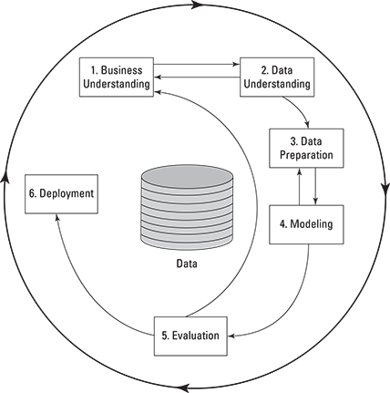

## Chapter 5: Embracing the Data-Mining Process

### In this chapter
    - Establishing a framework for data mining
    - Drilling into the CRISP-DM process
    - Establishing good habits

Cross-Industry Standard Process for Data Mining (**CRISP-DM**)

### Whose Standard Is It, Anyway?

#### Approaching the process in phases

- **Documenting your work**
  - Much of the CRISP-DM process model is focused on reports and other documents that data miners create in the process of their work

### **I. Business Understanding (4 tasks)**

#### **1. Identifying your business goals**
    - A problem that your management wants to address
    - The business goals
    - Constraints (limitations on what you may do, the kinds of solutions that can be used, when the work must be completed, and so on)
    - Impact (how the problem and possible solutions fit in with the business)
#### **2. Assessing your situation**
    - 2.1. Inventory of resources: A list of all resources available for the project
    - 2.2. Requirements, assumptions, and constraints
    - 2.3. Risks and contingencies
    - 2.4. Terminology: Create a list of business terms and data-mining terms with definitions
    - 2.5. Costs and benefits
#### **3. Defining your data-mining goals**
    - Data-mining goals: Define data-mining deliverables, such as models, reports, presentations, and processed datasets.
    - Data-mining success criteria: Define the data-mining technical criteria necessary to support the business success criteria. Try to define these in quantitative terms (such as model accuracy or predictive improvement compared to an existing method). If the criteria must be qualitative, identify the person who makes the assessment.
#### **4. Producing your project plan**
    - Project plan
    - Initial assessment of tools and techniques

### **II. Data Understanding**

#### **1. Gathering data**
    - Outline data requirements
    - Verify data availability
    - Define selection criteria
    - Finally, summarize the gathering process in a **report**. The report should describe your requirements, and explain in some detail exactly what data you have gathered and from what sources.
#### **2. Describing data**
    - data description report
    - source and formats of the data, the number of cases, the number and descriptions of the fields
    - and any other general information that may be important.
#### **3. Exploring data**
    - range of values and their distributions
    - data exploration **report** (including distributions, summaries, and any signs of data quality problems.)

#### **4. Verifying data quality**
    - The data you need doesn’t exist. 
    - It exists, but you can’t have it.
    - You find severe data quality issues (lots of missing or incorrect values that can’t be corrected).
    - data quality **report**
    - ummarizes the data that you have, minor and major quality issues that you have found
    - recommend reconsidering goals or plans.

### **III. Data Preparation**

#### **1. Selecting data**
    - explanin why you chooose the variables
    - relevance to your goals, data quality, and technical issues
#### **2. Cleaning data**
    - replace items
    - chooose to use subsets of the data
    - => report: decision and actions used to clean data, refer to each data quality problem

#### **3. Constructing data**
    - new fields, new form of data, aggregate data
    - 2 reports:
        - Derived attributes: A report that describes what new fields (columns) you have constructed, how you did it, and why.
        - Generated records: A report that describes what new cases (rows) you have constructed, how you did it, and why.

#### **4. Intergrating data**
    - merge disparate datasets
    - => merged data
  
#### **5. Formatting data**
    - convert formats
    - => report discribing the coversion

### **IV. Modeling**

#### **1. Selecting modeling techniques**
    - Modeling technique: Specify the technique(s) that you will use.
    - Modeling assumptions: Many modeling techniques are based on certain assumptions.
#### **2. Designing test(s)**
#### **3. Building model(s)**
    - Parameter settings
    - Model descriptions
    - Models
#### **4. Assessing model(s)**
    - Model assessment: Summarizes the information developed in your model review
    - Revised parameter settings: You may choose to fine-tune settings that were used to build the model and conduct another round of modeling and try to improve your results.

### **V. Evaluation**
#### **1. Evaluating results**
#### **2. Reviewing the process**
#### **3. Determining the next steps**
    - List of possible actions
    - Decision

### **VI. Deployment**

#### **1. Planning deployment (your methods for integrating data-mining discoveries into use)**
#### **2. Planning monitoring and maintenance**
#### **3. Reporting final results**
    - Final report: The final report summarizes the entire project by assembling all the reports created up to this point, and adding an overview summarizing the entire project and its results.
    - Final presentation: A summary of the final report is presented in a meeting with management. This is also an opportunity to address any open questions.
#### **4. Reviewing final results**
