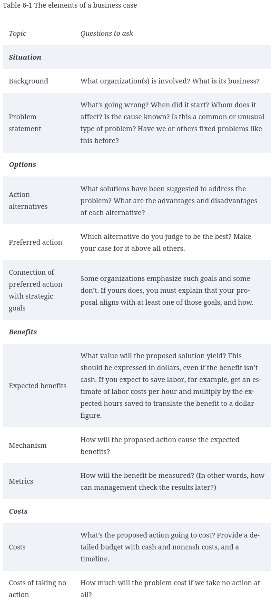

## Chapter 6: Planning for Data-Mining Success

### In this chapter
    - Making your business case
    - Developing plans
    - Mitigating risk

### **I. Setting the Course with Formal Business Cases**
    - **Costs**: costs for software, costs for labor, costs for servers, and perhaps costs to obtain data as well.
    - prepare a business case
    - Preparing a good business case clarifies your own thinking about plausible goals and your path to reaching them. It documents the reasoning behind your plan.
#### **1. Satisfying the boss**
#### **2. Minimizing your own risk**

### **II. Building Business Cases**

#### **1. Elements of the business case**

#### **2. Putting it in writing**
#### **3. The basics on benefits**
    - 2 kind of benefits:
        - Increased revenue
        - Decreased costs

### III. Avoiding the Failure Option**
    - Most organizations that make a data-mining investment never break even.
    - The number-one cause of data-mining failure: **Lack of planning**
    - Data miners fail because they fail to make plans to succeed.
