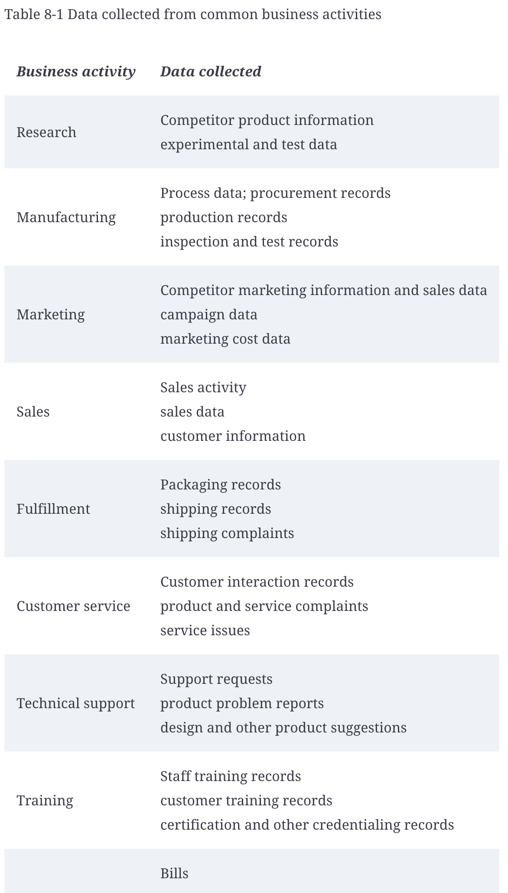

# Part 3: Gathering the Raw Materials

## In this part
    - Making the most of the data you have
    - Obtaining unique new data to fill gaps in your information
    - Taking advantage of government and other public data resources
    - Finding out what to expect from government agencies
    - Building awareness of commercial data options

## Chapter 8: Digging into Your Data

### In this chapter
    - Focusing on specific problems
    - Building on business knowledge
    - Appreciating the advantages of your own data

### **I. Focusing on a Problem**
    - break the question down into manageable bits
    - The object of data mining is to move beyond simply knowing what has already happened and understand how you may influence what will happen in the future.

### **II. Managing Scope**
    - As you work, you’ll have discussions with coworkers, and they’ll all have ideas and questions to inspire more exploration.
    - Your plan is your assurance that you will produce something of value, not just something that you find interesting.
    - More questions and answers

### **III. Using Your Organization’s Own Data**

### **IV. Appreciating your own data**
    - Internal source is superior to all external sources in a number of ways:
        - Unique relevance
        - Transparency
        - Detail
        - Range
        - Competitive advantage
        - Development potential

### **V. Handling data with respect**
    - When you access data and perform analysis, you must be careful to do so in ways that stay within your company’s guidelines and that don’t interfere with routine business processes.
    - You’ll have to discover things about what data is available, how to get access, and how to handle the data properly so that you don’t get in the way of others.
    - Discuss with data governance about your data mining work and how it will benifit the organization, why you need much data

