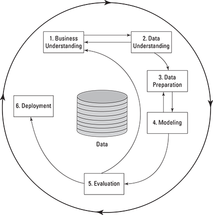

# Part 4: A Data Miner’s Survival Kit

## In this part:
- Getting data into your tool
- Manipulating data to suit your needs
- Preparing data for modeling
- Exploring data with graphs
- Building predictive models

## **Chapter 12: Getting Familiar with Your Data**

### In this chapter:
- Organizing data properly
- Importing data
- Examining your data
- Knowing data-mining terminology

### **1. Organizing data for Mining**
- Data mining has very strict requirements for data organization
- Data mining requires data organized with a single row for each case and a single column for each variable

### **2. Getting Data from There to Here**
- The most important influences include:
    - Data format: text, xml, spreadsheet, SQL
    - Data organization: structure
    - Software: KNIME, Orange, Weka, 
- Text:
    - A lot of softwares support csv importing

- Databases:
    - Direct access to operational databases can be a bad idea because: 
        - Data miners use a lot of data, 
        - Legal and other business obligations matter, 
        - Operational databases are not organized for data mining
    - Explain to db administrator about what data you need, the format, time (one time or ongoing),...
    - A common solution is to create an *analytic database*

- Spreadsheet, XML,...
    - If the application you use cant import data in these formats:
        - Check your data source for other formats
        - Convert the data format yourself
        - Use a different data-mining application
- Variable types:
    - Categorical:
        - Norminal: no order
        - Ordinal
    - Continuous:
        - Interval
        - Ratio

### **3. Surveying your data**
- The next step is to review the variables one by one.
- The data review is part of the data-understanding phase of the CRISP-DM process for data mining.

- You will need summaries for each variable of things such as
    - Number of missing cases
    - Minimum and maximum values
    - Averages and standard deviations (measures of variability)
    - Values of categorical variables