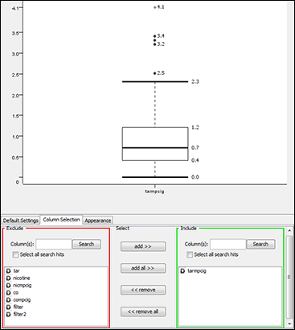

# Part 4: A Data Miner’s Survival Kit

## **Chapter 13: Dealing in Graphic Detail**

### In this chapter
- Using familiar graphs  in familiar ways
- Using familiar graphs in unfamiliar ways
- Adding new graphs to your bag of tricks

### Start Simple
- Categorical variable -> **bar chart**
- Continuos variable -> distribution -> **histogram**
- Relating one variable to another -> **scatterplots**

    

### Note
- People are pretty good at comparing lengths (one dimension) and not as good at comparing areas (two dimensions).

### Enhance
- **Boxplot**: median value, 25th and 75th percentile levels

    

- **Conditional boxplot**
- **Parallel coordinates**
- ...